 1.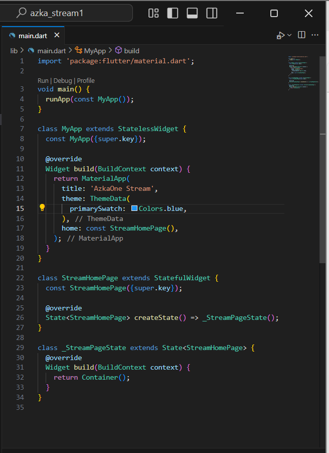
 2.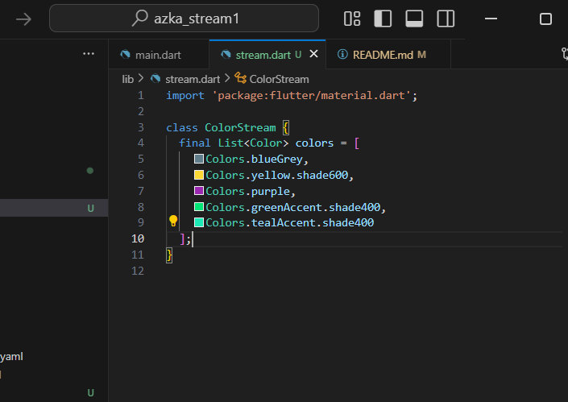
 3.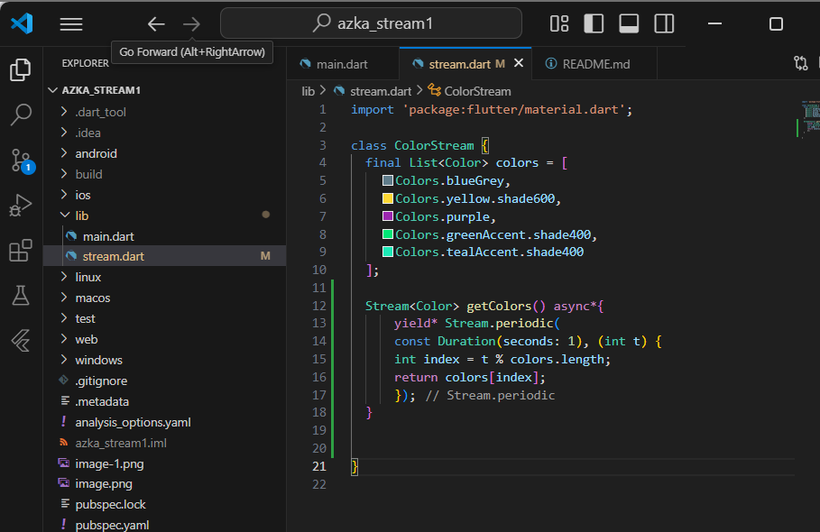
 yield digunakan untuk meneruskan aliran yang dihasilkan oleh stream.periodic
 - fungsi dari kode diatas untuk mereuskan data dari GetColor dengan waktu 1 detik
 4.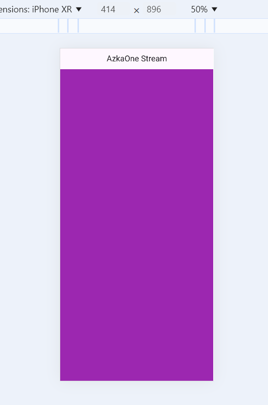
 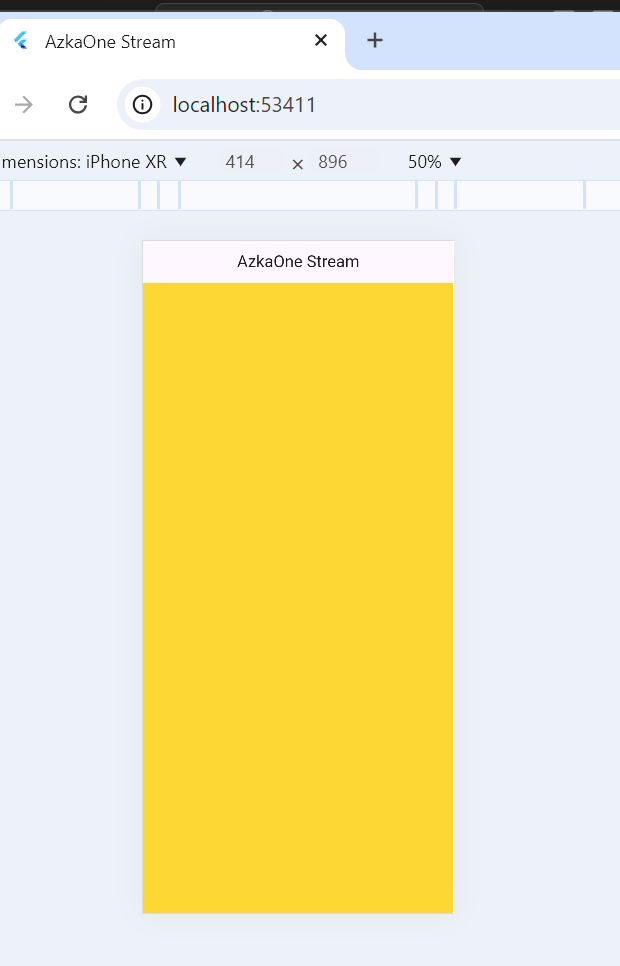
 5.perbedaan mengunakan listen dan awai for adalah listen bisa digunakan dimana saja sedangkan await for hanya bisa digunakan didalam fungsi async
 6.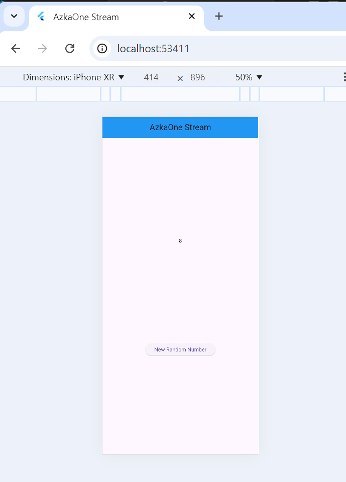
 7.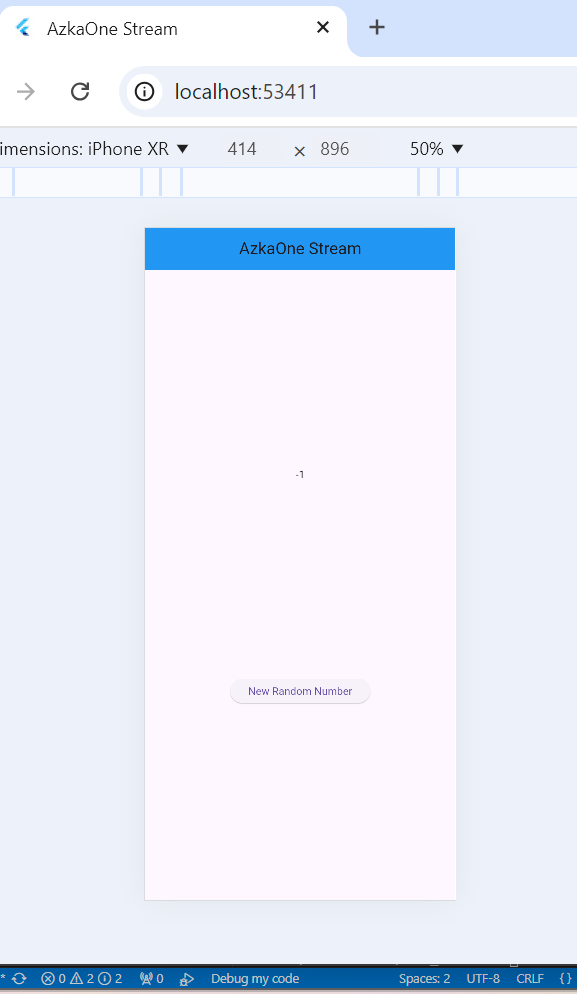
 addError digunakan untuk memasukan error kedalam stream yang digunakan ketika terjadi error ketika proses add number
 dan numberStrean.addError digunakan untuk memanggil fungsi adderror yang ada di fungi  initstate
 8.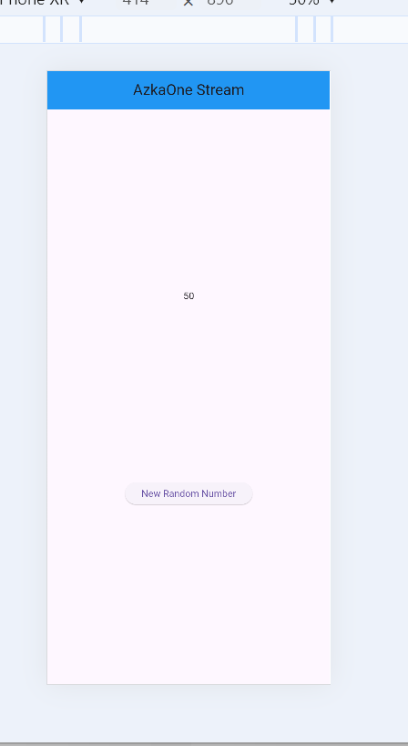
 dimulai dengan membuat  variabel bernama transformer
 yang dkedua melakukan setting agar ketika mnenekan tombol random number akan dikali 10 
 lalyu yang ketiga diogunakan untuk memproses data agar sesuai dengan yang ada di initstate
 9.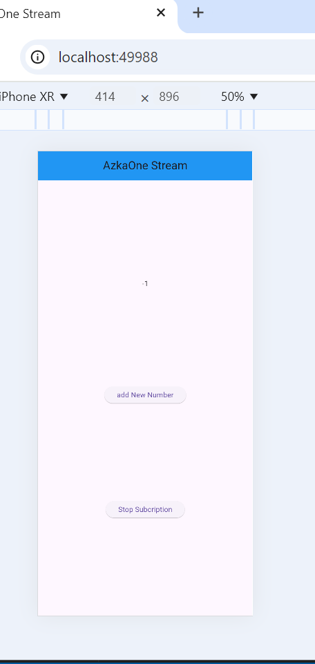
 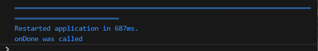
 pada langkah 2 digunakan untuk menampilkan event stream dan menagnggani srror atau kondisi selesai
 lalu pada dispose digunakan untuk melakukan stop
 dan menambhakan random number pada percobaan ke 8
 10.karena stream hanya bisa memanggil listener 1x saja
 11.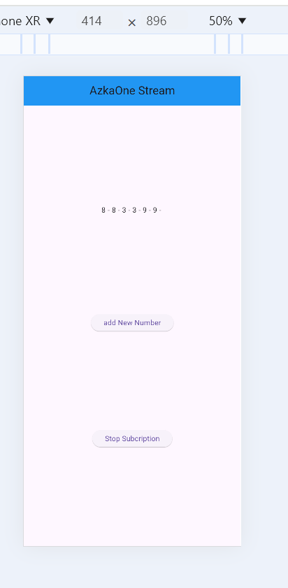
 mengunakan broadcaststream untuk memebuat stream dapat mengunakan banyak listener